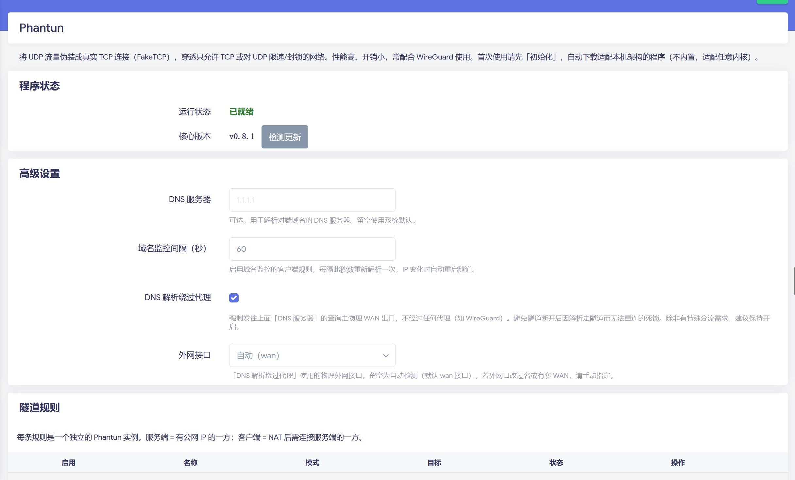

# luci-app-phantun

LuCI 界面，用于管理 [Phantun](https://github.com/dndx/phantun) —— 一个把 UDP 流量伪装成真实 TCP 连接（FakeTCP）的高性能混淆工具，常用于穿透只允许 TCP、或对 UDP 限速/封锁的网络，配合 WireGuard 使用效果尤佳。



## 特性

- **中文 Web 界面**，服务端 / 客户端多规则管理，每条规则独立启停，状态实时刷新（无需手动刷新页面）。
- **不内置二进制**：首次使用点「初始化」，自动检测本机架构（aarch64 / armv7 / x86_64 / mips 等），从 GitHub 下载官方对应版本，适配任意内核，插件本身保持轻量。
- **多节点智能下载**：并发向多个加速镜像发起探测（HEAD 竞速���，选择最快节点下载；直连 GitHub 作为最后备援。
- **抗慢速下载**：使用停滞超时（连续 30 秒无进展才判定失败），而非总超时，慢速网络也能完整下载，不会在 90% 处被误杀；单节点失败自动切换下一个。
- **实时进度**：初始化 / 更新过程弹窗流式显示日志与下载进度，全程无需刷新页面。
- **版本管理**：显示当前已安装版本，一键「检测更新」，发现新版可「立即更新」。
- **自动防火墙（服务端）**：勾选后自动向系统防火墙写入端口转发（DNAT），同时覆盖 IPv4 与 IPv6，规则在「网络 → 防火墙 → 端口转发」页面可见；取消勾选或卸载会自动清除。
- **域名监控 / DDNS（客户端）**：对端为域名时定期重解析，IP 变化自动重启隧道。
- **DNS 解析绕过代理**：强制解析 DNS 的流量走物理 WAN，避免隧道断开后"解析走隧道→无法重连"的死锁。
- **干净卸载**：卸载插件会停止进程、移除下载的二进制、清理配置与残留文件。

## 依赖

- `kmod-tun`（Phantun 需要创建 TUN 接口）
- `unzip`（解压官方发布包）
- `curl`（多节点下载）
- `bind-host` 或 `drill`（域名解析，二者其一即可）

安装插件时会自动拉取上述依赖（请确保已 `opkg update`）。

## 安装

```sh
opkg update
opkg install luci-app-phantun_*.ipk
```

安装后进入 LuCI：**服务 → Phantun**，点「初始化」下载核心程序，就绪后即可添加隧道规则。

## 使用说明

Phantun 会创建 TUN 虚拟网卡（客户端 `192.168.200.2`/`fcc8::2`，服务端 `192.168.201.2`/`fcc9::2`），插件自动开启 IP 转发并配置所需规则。

### 服务端（有公网 IP 的一方）

- **模式**：服务端
- **本地端口**：对外监听的 TCP 端口（Phantun 客户端连接此端口）
- **对端地址 / 端口**：要转发到的 UDP 服务，通常是本机 WireGuard，如 `127.0.0.1` / `51820`
- **自动防火墙**：建议勾选。自动把外网 TCP 端口转发到 Phantun 并放行（IPv4 + IPv6），无需手动配置。规则会出现在系统「端口转发」页面，取消勾选即自动清除。

### 客户端（NAT 后需要连接服务端的一方）

- **模式**：客户端
- **本地地址 / 端口**：本地暴露的 UDP 端点，供本地应用（如 WireGuard）连接，通常 `127.0.0.1` / `51820`
- **对端地址 / 端口**：Phantun 服务端的 IP/域名 与 TCP 端口
- **地址族**：对端为域名时，选择解析 IPv4（A）还是 IPv6（AAAA）；对端为 IP 时忽略
- **域名监控**：对端为动态域名时勾选，IP 变化自动重连
- 客户端**无需任何防火墙配置**（本机应用连本机 Phantun 端口，出口走系统默认 WAN 伪装）

### 配合 WireGuard 的 MTU

Phantun 每个包额外开销 12 字节。若链路 MTU 为 1500，WireGuard 接口 MTU 建议：

- IPv4：`1500 - 20(IP) - 20(TCP) - 32(WG) = 1428`
- IPv6：`1500 - 40(IP) - 20(TCP) - 32(WG) = 1408`

两端应使用相同的接口 MTU，否则可能出现难以排查的丢包。

## 说明

- 本插件仅提供管理界面，Phantun 二进制版权归 [原作者](https://github.com/dndx/phantun) 所有。
- 下载的二进制存放于 `/usr/bin/phantun_server`、`/usr/bin/phantun_client`。

## 许可

Apache-2.0
