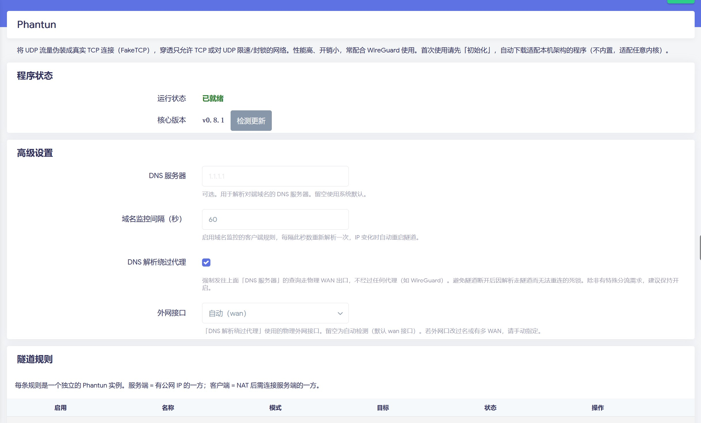

# luci-app-phantun

LuCI 界面，用于管理 [Phantun](https://github.com/Dage1819/phantun) —— 一个把 UDP 流量伪装成真实 TCP 连接（FakeTCP）的高性能混淆工具，常用于穿透只允许 TCP、或对 UDP 限速/封锁的网络，配合 WireGuard 使用效果尤佳。



## 特性

- **中文 Web 界面**，服务端 / 客户端多规则管理，每条规则独立启停，状态实时刷新（无需手动刷新页面）。
- **手动上传核心**：插件不内置二进制，也不自动联网下载。首次使用在「核心程序」页面按提示下载 ZIP、在电脑上解压，然后分别上传 `phantun_client` 和 `phantun_server`（ELF 文件，本地文件名不限，上传后自动安装为标准名称）。
- **握手状态**：规则运行中实时显示握手成功/握手中/未连接（基于 conntrack，反映当前真实状态）。
- **查看日志**：点击握手状态旁的链接弹出该规则的过滤日志（保留错误/超时/关闭事件，过滤掉高频重试噪音）。
- **域名解析 IP 显示**：客户端规则 remote 为域名时，在规则列表显示当前实际解析并传给 Phantun 的 IP。
- **自动防火墙（服务端）**：勾选后自动向系统防火墙写入端口转发（DNAT），同时覆盖 IPv4 与 IPv6，规则在「网络 → 防火墙 → 端口转发」页面可见；取消勾选或卸载会自动清除。
- **域名监控 / DDNS（客户端）**：对端为域名时定期重解析，IP 变化自动重启隧道。
- **DNS 解析绕过代理**：强制解析 DNS 的流量走物理 WAN，避免隧道断开后"解析走隧道→无法重连"的死锁。
- **服务端例外路由**：全局代理场景下，自动为 Phantun 服务端 IP 写入走物理 WAN 的静态路由，解除"隧道要靠自己才能建立"的死锁。
- **干净卸载**：卸载插件会停止进程、移除上传的二进制、清理配置与残留文件。

## 依赖

- `kmod-tun`（Phantun 需要创建 TUN 接口）
- `bind-host` 或 `drill`（域名解析，二者其一即可）

安装插件时会自动拉取上述依赖（请确保已 `opkg update` / `apk update`）。

无需 `curl` 或 `unzip`——核心程序由用户手动上传，插件不发起任何网络请求。

## 安装

**IPK（OpenWrt 24.10 及以前，opkg）：**
```sh
opkg update
opkg install luci-app-phantun_*.ipk
```

**APK（OpenWrt 25.x+，apk）：**
```sh
apk add --allow-untrusted luci-app-phantun-*.apk
```

## 核心程序安装

插件不自动下载 Phantun 二进制。安装插件后进入 LuCI：**服务 → Phantun**，在「核心程序」区域：

1. 页面显示本机目标架构（如 `aarch64-unknown-linux-musl`）和对应 ZIP 文件名。
2. 点击「前往 Releases 页面」链接，在电脑上下载对应 ZIP 并解压。
3. 分别点击「上传安装 phantun_client」和「上传安装 phantun_server」，选择解压出的 ELF 文件。本地文件名不限，安装后自动命名为标准名称。
4. 两个核心均安装后，状态变为「已就绪」，即可添加隧道规则。

> **提示**：如需替换版本，随时重新上传即可。服务运行中上传会先停止再重启。

## 使用说明

Phantun 会创建 TUN 虚拟网卡（客户端 `192.168.200.2`/`fcc8::2`，服务端 `192.168.201.2`/`fcc9::2`），插件自动开启 IP 转发并配置所需规则。

### 服务端（有公网 IP 的一方）

- **模式**：服务端
- **本地端口**：对外监听的 TCP 端口（Phantun 客户端连接此端口）
- **对端地址 / 端口**：要转发到的 UDP 服务，通常是本机 WireGuard，如 `127.0.0.1` / `51820`
- **自动防火墙**：建议勾选。自动把外网 TCP 端口转发到 Phantun 并放行（IPv4 + IPv6），无需手动配置。规则会出现在系统「端口转发」页面，取消勾选即自动清除。

### 客户端（NAT 后需要连接服务端的一方）

- **模式**：客户端
- **本地地址 / 端口**：本地暴露的 UDP 端点，供本地应用（如 WireGuard）连接，通常 `127.0.0.1` / `51820`
- **对端地址 / 端口**：Phantun 服务端的 IP/域名 与 TCP 端口
- **地址族**：对端为域名时，选择解析 IPv4（A）还是 IPv6（AAAA）；对端为 IP 时忽略
- **域名监控**：对端为动态域名时勾选，IP 变化自动重连
- 客户端**无需任何防火墙配置**

### 配合 WireGuard 的 MTU

Phantun 每个包额外开销 12 字节。若链路 MTU 为 1500，WireGuard 接口 MTU 建议：

- IPv4：`1500 - 20(IP) - 20(TCP) - 32(WG) = 1428`
- IPv6：`1500 - 40(IP) - 20(TCP) - 32(WG) = 1408`

两端应使用相同的接口 MTU，否则可能出现难以排查的丢包。

### TCP 指纹伪装（可选）

在「额外参数」填写 `--time` 可开启 TCP 指纹伪装（需两端同时填写），使握手包更接近真实系统的 TCP 连接，减少被 DPI 识别的可能。须使用支持该参数的 Phantun 分支（如 [Dage1819/phantun](https://github.com/Dage1819/phantun)）。

## 说明

- 本插件仅提供管理界面，Phantun 二进制版权归 [原作者](https://github.com/dndx/phantun) 所有。
- 上传的二进制存放于 `/usr/bin/phantun_server`、`/usr/bin/phantun_client`。

## 许可

Apache-2.0
